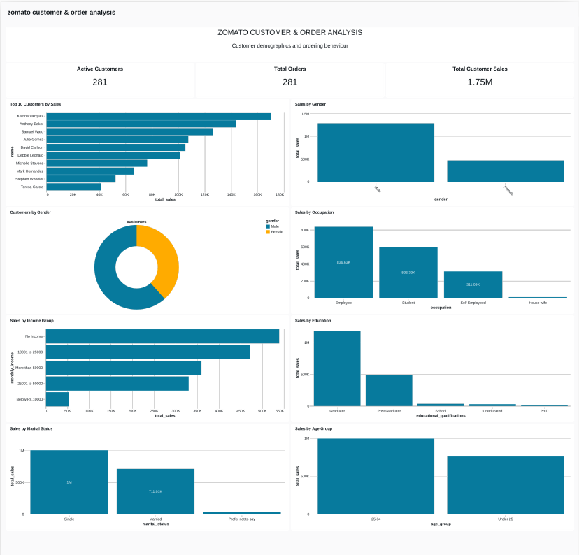
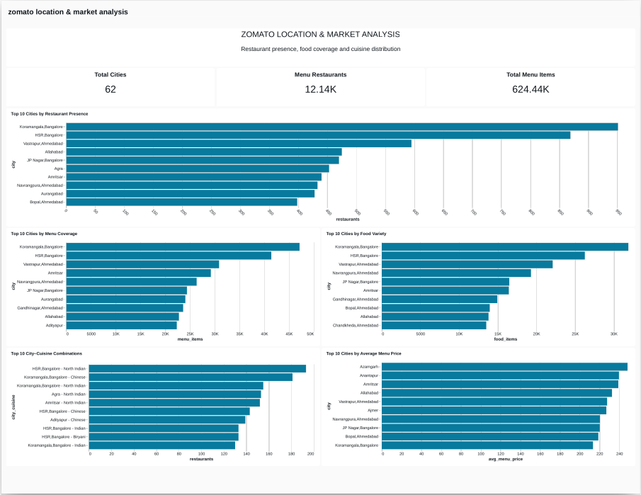
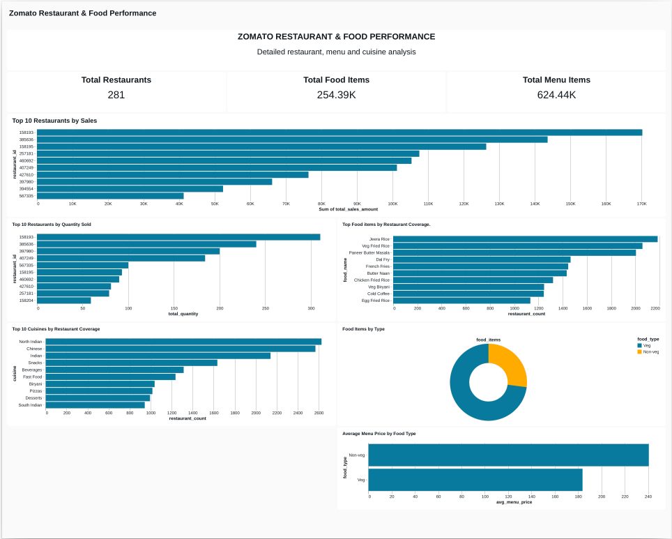
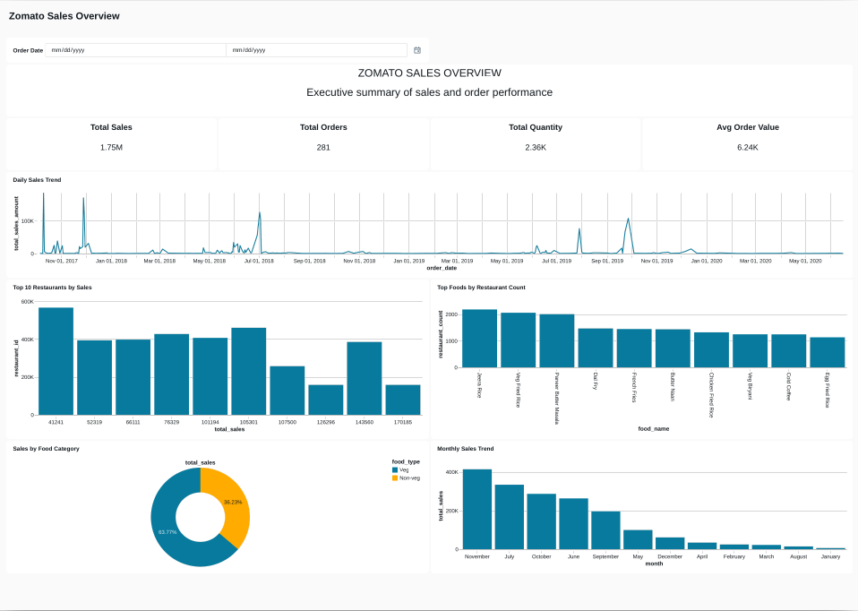

# Zomato Databricks Lakehouse & Analytics Project

An end-to-end data engineering project built on Databricks using
PySpark, Spark SQL, Delta Lake, and Databricks SQL.

The project implements a Medallion Architecture (Bronze → Silver → Gold)
to transform raw Zomato CSV data into validated, analytics-ready datasets
and business dashboards.

## 🚦 Project Status

**Portfolio-ready implementation**

The core data engineering pipeline has been implemented and validated,
including:

- Bronze, Silver, and Gold Lakehouse layers
- Delta-based data storage
- PySpark and Spark SQL transformations
- Data quality validation
- Gold analytical datasets
- Databricks SQL dashboards
- Databricks lineage documentation
- GitHub Actions CI validation

---

## 🎯 Project Objectives

The main objectives of this project are to:

* Build an end-to-end data pipeline using Databricks
* Implement a Bronze → Silver → Gold Lakehouse architecture
* Process CSV source data using PySpark and Spark SQL
* Store transformed data using Delta tables
* Clean and standardize raw data
* Handle invalid and duplicate records
* Implement dimensional and analytical modeling
* Build analytics-ready Gold datasets
* Perform data quality and validation checks
* Create business-oriented analytical datasets
* Build interactive dashboards using Databricks SQL
* Demonstrate practical data engineering best practices

---

## 🏗️ Architecture

The project follows a Medallion/Lakehouse architecture:

```text
                    ┌──────────────────────┐
                    │     Source CSVs      │
                    │                      │
                    │ countries.csv        │
                    │ foods.csv            │
                    │ menus.csv            │
                    │ orders.csv           │
                    │ restaurants.csv      │
                    │ users.csv            │
                    └──────────┬───────────┘
                               │
                               ▼
                    ┌──────────────────────┐
                    │    Bronze Layer      │
                    │                      │
                    │ Raw/Ingested Data    │
                    │ Delta Tables         │
                    └──────────┬───────────┘
                               │
                               ▼
                    ┌──────────────────────┐
                    │     Silver Layer     │
                    │                      │
                    │ Cleaning             │
                    │ Standardization      │
                    │ Type Casting         │
                    │ Deduplication        │
                    │ Data Validation      │
                    └──────────┬───────────┘
                               │
                               ▼
                    ┌──────────────────────┐
                    │      Gold Layer      │
                    │                      │
                    │ Dimensions           │
                    │ Analytical Datasets  │
                    │ Aggregations         │
                    │ Business Metrics     │
                    └──────────┬───────────┘
                               │
                               ▼
                    ┌──────────────────────┐
                    │  Databricks SQL      │
                    │     Dashboards       │
                    │                      │
                    │ KPIs & Analytics     │
                    └──────────────────────┘
```

---

## 🥉 Bronze Layer

The Bronze layer contains the initially ingested source data.

Source datasets include:

* `countries`
* `foods`
* `menus`
* `orders`
* `restaurants`
* `users`

Metadata such as ingestion timestamp and source file information is retained to support data lineage and traceability.

---

## 🥈 Silver Layer

The Silver layer contains cleaned and standardized datasets.

Key transformations include:

* Trimming leading and trailing whitespace
* Standardizing column values
* Casting columns to appropriate data types
* Removing duplicate records
* Filtering invalid or null business keys
* Standardizing restaurant, food, user, and order identifiers
* Converting order dates to proper date types
* Validating relationships between datasets

The cleaned Silver tables are stored as Delta tables under the `workspace.zomato_silver` schema.

### Silver Tables

| Table         | Purpose                     |
| ------------- | --------------------------- |
| `countries`   | Country reference data      |
| `foods`       | Food/item information       |
| `menus`       | Restaurant menu information |
| `orders`      | Customer order transactions |
| `restaurants` | Restaurant information      |
| `users`       | Customer/user information   |

---

## 🥇 Gold Layer

The Gold layer provides analytics-ready datasets designed for business reporting and dashboard development.

Current Gold datasets include:

### Dimension Tables

| Table             |    Rows |
| ----------------- | ------: |
| `dim_restaurants` | 148,541 |
| `dim_users`       | 100,000 |
| `dim_foods`       | 371,563 |


### Analytical Tables

| Table                     |    Rows |
| ------------------------- | ------: |
| `restaurant_performance`  |     281 |
| `customer_order_analysis` |     281 |
| `food_menu_analysis`      | 665,517 |
| `daily_sales`             |     209 |


The Gold layer combines cleaned transactional and reference data to provide meaningful business metrics for analytical reporting.

---

## 🔍 Data Quality

Data quality checks are included as part of the pipeline.

Current validation checks include:

* Row-count validation
* Null key validation
* Duplicate-key detection
* Distinct-key validation
* Uniqueness validation
* Referential integrity checks
* Invalid identifier detection
* Overall table status validation

All validated Gold analytical datasets passed the implemented
data-quality checks.

See [`05_data_quality.ipynb`](notebooks/05_data_quality.ipynb) for the
implemented validation checks.

---

## 📊 Databricks SQL Dashboards

The Gold analytical datasets are consumed by Databricks SQL dashboards
covering the following business areas.

### Customer & Order Analysis

Analysis of customer ordering behavior, order volume, sales,
and customer-level activity.



### Location & Market Analysis

Analysis of restaurant presence, food coverage, cities,
and cuisine distribution.



### Restaurant & Food Performance

Analysis of restaurant performance, food items, menus,
and related business metrics.



### Sales Overview

Analysis of sales trends, order volume, revenue,
and average order metrics.




## 📁 Project Structure

```text
zomato-databricks-lakehouse/
├── .github/
│   └── workflows/
│       └── ci.yml
├── data/
│   └── source/
├── docs/
│   ├── architecture/
│   └── dashboards/
├── notebooks/
│   ├── 01_bronze_ingestion.ipynb
│   ├── 02_silver_transformation.ipynb
│   ├── 03_gold_dimensions.ipynb
│   ├── 04_gold_analytics.ipynb
│   └── 05_data_quality.ipynb
├── sql/
│   ├── bronze/
│   ├── silver/
│   ├── gold/
│   └── three-schemas.sql
├── src/
├── tests/
├── .gitignore
├── README.md
└── requirements.txt
```
---
## 🛠️ Technologies

The project currently uses:

* **Databricks**
* **Apache Spark**
* **PySpark**
* **Spark SQL**
* **Delta Lake**
* **Databricks SQL**
* **Git / GitHub**
* **Python**
* **GitHub Actions**

---

## 📓 Notebooks

| Notebook                         | Purpose                                     |
| -------------------------------- | ------------------------------------------- |
| `01_bronze_ingestion.ipynb`      | Ingests source CSV data into Bronze         |
| `02_silver_transformation.ipynb` | Cleans and standardizes Silver data         |
| `03_gold_dimensions.ipynb`       | Creates Gold dimension tables               |
| `04_gold_analytics.ipynb`        | Creates Gold analytical datasets            |
| `05_data_quality.ipynb`          | Performs data quality and validation checks |

---

## 📈 Processed Data Scale

The current implementation processes approximately:

| Dataset     | Records |
| ----------- | ------: |
| Foods       |   371K+ |
| Menus       |   665K+ |
| Restaurants |   148K+ |
| Users       |    100K |
| Orders      |     281 |
| Countries   |     249 |

The relatively small order dataset is useful for demonstrating the complete pipeline architecture, transformation logic, dimensional modeling, data quality validation, and dashboard workflow.

---

## 🔄 End-to-End Pipeline

The current workflow is:

```text
CSV Source Data
      ↓
Bronze Ingestion
      ↓
Silver Transformation
      ↓
Data Cleaning & Validation
      ↓
Gold Dimensions
      ↓
Gold Analytical Datasets
      ↓
Data Quality Checks
      ↓
Databricks SQL
      ↓
Analytics Dashboards
```

---

## 🚀 Future Improvements

Possible future enhancements include:

- Incremental data ingestion
- Automated pipeline orchestration
- Expanded data-quality monitoring
- Schema evolution handling
- Additional business metrics
- Production-oriented monitoring and alerting
- Advanced analytics and forecasting
- Automated Databricks deployment workflows

---

## 📌 Project Purpose

This project is intended as a practical demonstration of **modern data engineering using Databricks and Lakehouse architecture**.

It focuses not only on moving data from source to destination, but also on:

**data quality → transformation → modeling → analytics → visualization**

The goal is to demonstrate how raw operational data can be transformed into reliable, analytics-ready datasets for business intelligence and decision-making.
