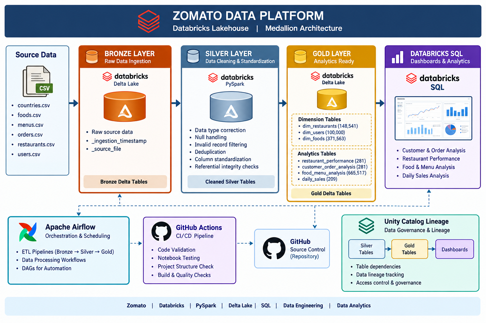
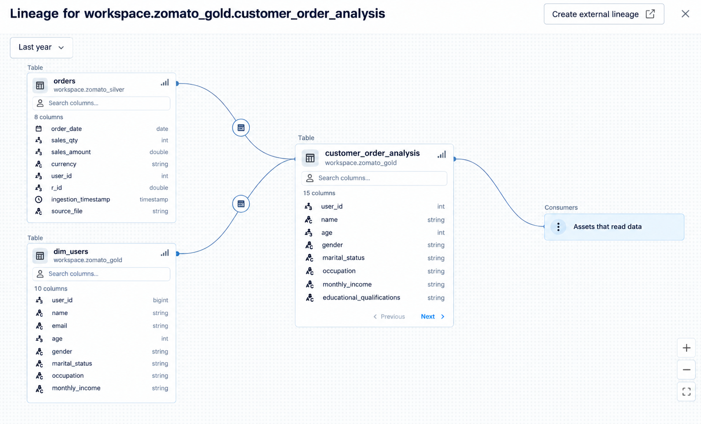
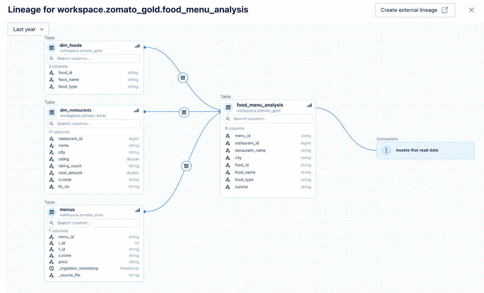
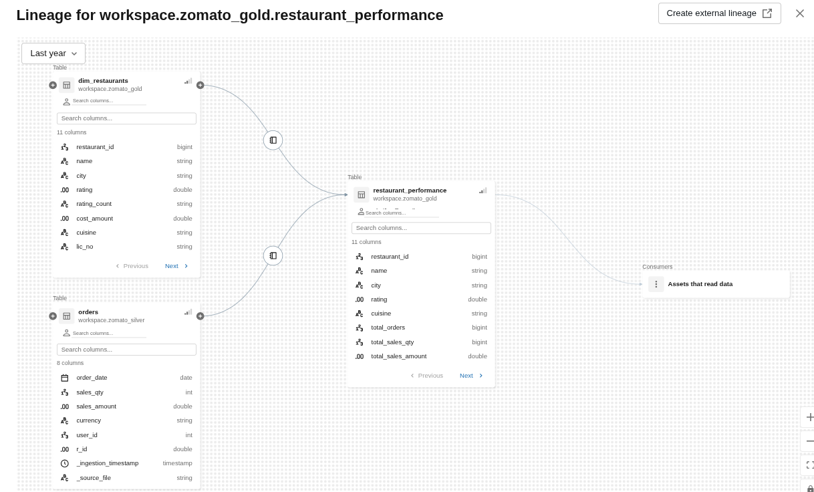
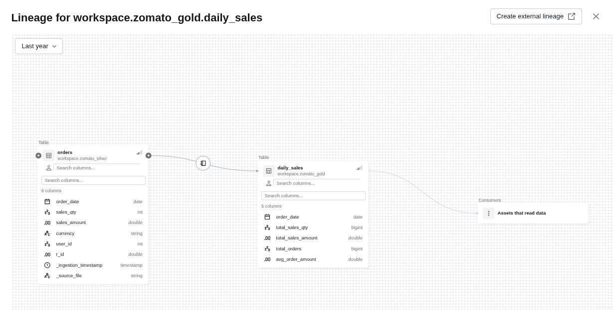

# Zomato Databricks Lakehouse Architecture

## Overview

The Zomato Data Platform is implemented using Databricks and follows
a Medallion Architecture consisting of Bronze, Silver, and Gold layers.

The pipeline transforms raw Zomato CSV datasets into cleaned,
validated, analytics-ready Delta tables for Databricks SQL dashboards.

## Architecture



The architecture separates data ingestion, data transformation,
data quality validation, analytical modeling, and business reporting.

---

## Data Flow

The overall data flow is:

CSV Source Data
→ Bronze Layer
→ Silver Layer
→ Gold Layer
→ Databricks SQL Dashboards

The project is implemented using PySpark, Spark SQL, Delta Lake,
and Databricks SQL.

---

## Bronze Layer

The Bronze layer contains the initially ingested source data.

### Source datasets

- `countries.csv`
- `foods.csv`
- `menus.csv`
- `orders.csv`
- `restaurants.csv`
- `users.csv`

The ingestion process preserves source information and adds metadata
for data traceability:

- `_ingestion_timestamp`
- `_source_file`

The Bronze data is stored as Delta tables.

### Bronze objectives

- Ingest source data
- Preserve the original source structure
- Capture ingestion metadata
- Provide a reliable input layer for downstream transformations

---

## Silver Layer

The Silver layer contains cleaned, standardized, and validated data.

The transformation process includes:

- Data type correction
- Column name standardization
- Null handling
- Duplicate removal
- Invalid-record filtering
- Identifier validation
- Referential-integrity checks
- Data standardization

### Silver datasets

- `countries`
- `foods`
- `menus`
- `orders`
- `restaurants`
- `users`

The cleaned Silver datasets are stored as Delta tables in:

`workspace.zomato_silver`

---

## Gold Layer

The Gold layer contains analytics-ready datasets designed for
business analysis and Databricks SQL dashboards.

### Dimension Tables

| Table | Rows |
|---|---:|
| `dim_restaurants` | 148,541 |
| `dim_users` | 100,000 |
| `dim_foods` | 371,563 |

### Analytics Tables

| Table | Rows |
|---|---:|
| `restaurant_performance` | 281 |
| `customer_order_analysis` | 281 |
| `food_menu_analysis` | 665,517 |
| `daily_sales` | 209 |

The Gold datasets are stored as Delta tables in:

`workspace.zomato_gold`

### Gold Layer Objectives

- Provide analytics-ready datasets
- Combine relevant business entities
- Create business-level metrics
- Support Databricks SQL dashboards
- Reduce the complexity of downstream analytical queries

---

## Data Quality

Data quality validation is implemented as a dedicated stage of the
data engineering workflow.

The validation framework checks:

- Row counts
- Null business keys
- Duplicate keys
- Key uniqueness
- Referential integrity
- Invalid identifiers
- Overall table status

The data quality process validates the analytical datasets before
they are consumed by dashboards.

The validation results are recorded by the
`05_data_quality.ipynb` notebook.

---

## Data Lineage

Databricks lineage provides visibility into upstream and downstream
dependencies between project datasets.

The lineage views demonstrate how Gold analytical datasets are
derived from their upstream Silver and Gold tables.

### Customer Order Analysis



### Food Menu Analysis



### Restaurant Performance



### Daily Sales



---

## Analytics Layer

The Gold datasets are consumed by Databricks SQL dashboards.

Current analytical areas include:

- Customer and order analysis
- Restaurant performance
- Food and menu analysis
- Daily sales analysis
- Location and market analysis

Dashboard documentation and exported dashboard files are available
under:

`docs/dashboards/`

---

## Project Notebooks

The main notebooks implement the end-to-end data engineering workflow.

| Notebook | Purpose |
|---|---|
| `01_bronze_ingestion.ipynb` | Ingests source CSV data into the Bronze layer |
| `02_silver_transformation.ipynb` | Cleans and standardizes source data |
| `03_gold_dimensions.ipynb` | Creates Gold dimension tables |
| `04_gold_analytics.ipynb` | Creates Gold analytical datasets |
| `05_data_quality.ipynb` | Performs data quality and validation checks |

---

## Technology Stack

- Databricks
- Apache Spark
- PySpark
- Spark SQL
- Delta Lake
- Databricks SQL
- Python
- Git
- GitHub
- GitHub Actions

---

## Repository Organization

The repository separates data, documentation, notebooks, SQL,
source code, and automated tests.

```text
zomato-databricks-lakehouse/
│
├── data/
│   └── source/
│
├── docs/
│   ├── architecture/
│   └── dashboards/
│
├── notebooks/
│
├── sql/
│   ├── bronze/
│   ├── silver/
│   └── gold/
│
├── src/
│   ├── bronze/
│   ├── silver/
│   └── gold/
│
├── tests/
│
├── README.md
├── requirements.txt
└── .github/
    └── workflows/